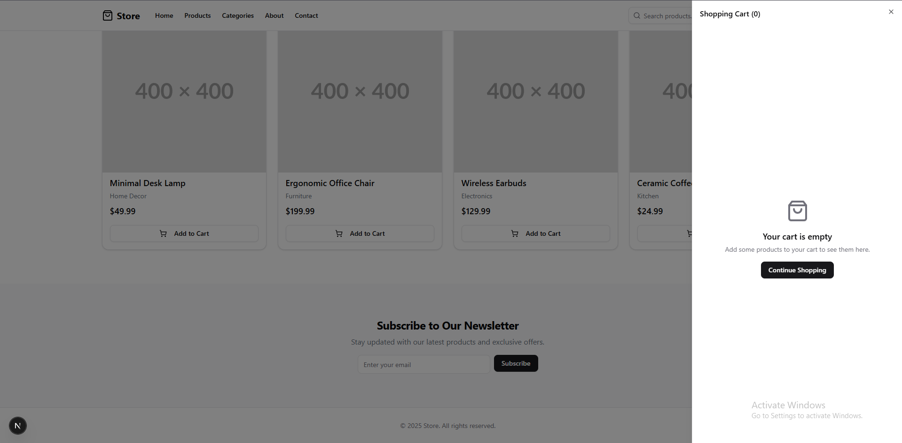
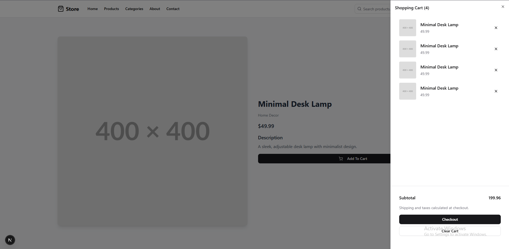
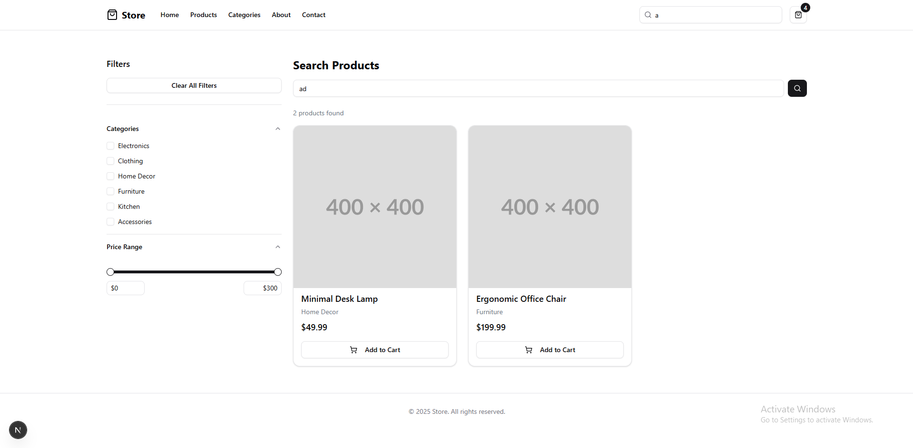

# Green Life - Cửa hàng sản phẩm xanh

Green Life là một nền tảng thương mại điện tử hiện đại, chuyên cung cấp các sản phẩm thân thiện với môi trường, bền vững và bảo vệ hành tinh. Website được xây dựng với mục tiêu giúp người tiêu dùng dễ dàng tiếp cận các giải pháp sống xanh hàng ngày.

## 🌿 Sứ mệnh

Chúng tôi tin rằng mỗi thay đổi nhỏ trong thói quen tiêu dùng đều có thể tạo ra tác động lớn cho môi trường. Green Life cung cấp các sản phẩm từ vật liệu tái chế, tự phân hủy sinh học và không chứa nhựa dùng một lần.

## 🎯 Giao diện ứng dụng

### Giỏ hàng:



### Trang sản phẩm:



### Trang tìm kiếm:



## 🚀 Tính năng nổi bật

### Chức năng chính

- **Danh mục sản phẩm xanh**: Khám phá các sản phẩm từ đồ gia dụng đến phụ kiện cá nhân thân thiện với môi trường.
- **Tìm kiếm nâng cao**: Tìm kiếm nhanh chóng và lọc theo danh mục hoặc khoảng giá.
- **Giỏ hàng thông minh**: Thêm/xóa sản phẩm với dữ liệu được lưu trữ tạm thời trên trình duyệt (localStorage).
- **Quy trình thanh toán**: Giao diện thanh toán đơn giản, tối ưu hóa trải nghiệm người dùng.
- **Thiết kế Responsive**: Hoạt động mượt mà trên mọi thiết bị: di động, máy tính bảng và máy tính để bàn.

### Giao diện & Trải nghiệm (UI/UX)

- **Thiết kế tối giản**: Phong cách hiện đại, tập trung vào hình ảnh sản phẩm và thông điệp sống xanh.
- **Thành phần shadcn/ui**: Sử dụng các component chuẩn, dễ tiếp cận và đồng nhất.
- **Loading States**: Hiệu ứng chuyển cảnh mượt mà và các chỉ báo đang tải.

### Kỹ thuật

- **Next.js App Router**: Hệ thống routing hiện đại từ Next.js.
- **TypeScript**: Đảm bảo tính ổn định và an toàn của mã nguồn.
- **State Management**: Sử dụng React Context để quản lý trạng thái giỏ hàng.
- **Tối ưu hiệu suất**: Tự động tối ưu hóa hình ảnh và render hiệu quả.

## 🛠️ Công nghệ sử dụng

- **Framework**: [Next.js 15](https://nextjs.org/) (App Router)
- **Styling**: [Tailwind CSS](https://tailwindcss.com/)
- **UI Components**: [shadcn/ui](https://ui.shadcn.com/)
- **Icons**: [Lucide React](https://lucide.dev/)
- **Language**: [TypeScript](https://www.typescriptlang.org/)

## 📦 Hướng dẫn cài đặt

### Yêu cầu hệ thống

- Node.js 18 trở lên
- npm, yarn, hoặc pnpm

### Các bước thực hiện

1. **Tải mã nguồn về máy**

   ```bash
   git clone https://github.com/yourusername/green-life
   cd green-life
   ```

2. **Cài đặt thư viện**

   ```bash
   npm install
   ```

3. **Chạy môi trường phát triển**

   ```bash
   npm run dev
   ```

4. **Mở trình duyệt**
   Truy cập [http://localhost:3000](http://localhost:3000) để xem kết quả.

## 🎯 Các trang chính

### Trang chủ (`/`)

- Hero section với thông điệp sống xanh.
- Danh sách sản phẩm nổi bật.
- Điều hướng theo danh mục.
- Đăng ký nhận bản tin môi trường.

### Danh sách sản phẩm (`/products`)

- Hiển thị toàn bộ các sản phẩm xanh.
- Thẻ sản phẩm với giá cả và hình ảnh trực quan.

### Chi tiết sản phẩm (`/products/[id]`)

- Thông tin chi tiết về vật liệu và nguồn gốc sản phẩm.
- Tính năng thêm vào giỏ hàng.

### Tìm kiếm (`/search`)

- Bộ lọc theo danh mục và giá.
- Kết quả tìm kiếm thời gian thực.

## 🎨 Tùy chỉnh

- **Giao diện**: Chỉnh sửa tại `app/globals.css` hoặc cấu hình Tailwind.
- **Dữ liệu sản phẩm**: Cập nhật danh sách sản phẩm tại `lib/data.ts`.
- **Components**: Các thành phần UI nằm trong thư mục `components/`.

## 🔮 Định hướng phát triển

- Tích hợp cổng thanh toán trực tuyến.
- Hệ thống đánh giá sản phẩm từ người dùng.
- Blog chia sẻ kiến thức sống xanh.
- Tài khoản người dùng và lịch sử đơn hàng.
- Chế độ Dark Mode (Giao diện tối).

## 📝 Bản quyền

Dự án này là mã nguồn mở và được phát hành dưới giấy phép [MIT](LICENSE).

---

**Được xây dựng với ❤️ nhằm bảo vệ môi trường xanh**
